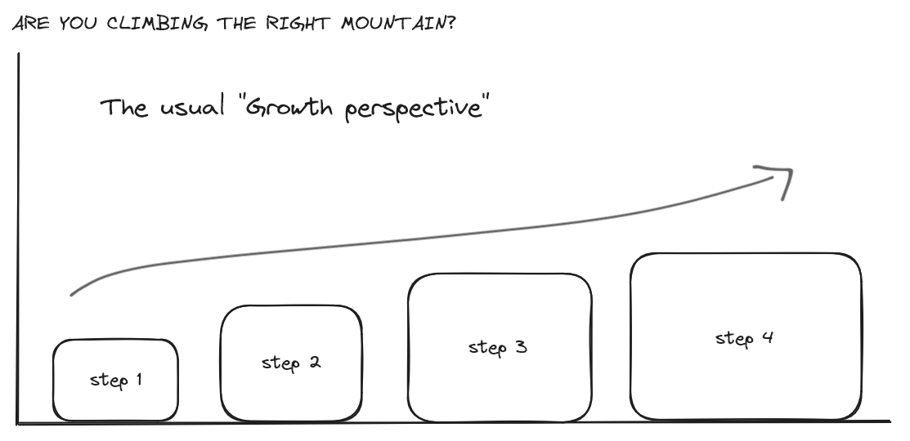
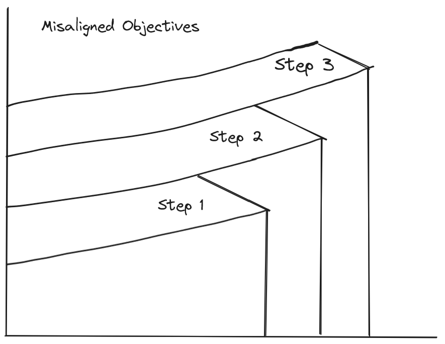
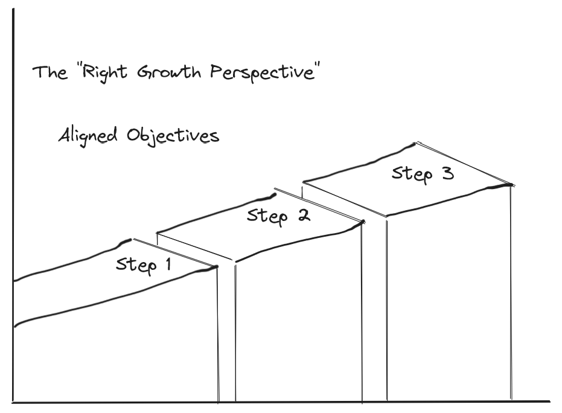

# Are you climbing the right mountain?
July 21, 2024
Are your daily objectives aligned with your long-term goal? Do you have a long-term goal?

Everyone climbs a mountain in their life in one way or the other. Be it physically climbing an actual mountain or mentally in the form of learning a difficult skill. In either case, one ends up drafting a plan of action that they intend to follow.

Unbeknownst to you, you might have already done this exercise many times up until now. However, as life progresses, doing this exercise consciously becomes tougher. It becomes easier to get lost in the process of preparing to doing something than actually doing it.

With great determination if you actually persevere through the plan, how do you know that your steps and skills you learn at the end of each step are directly helping you in reaching your goal, without taking a leap of faith?

In other words, are you walking the trail that leads to the summit of your mountain? Or did you lose direction and end up in a different trail that's leading to a different summit?

**Are you climbing the right mountain?**

I'd like to share my objective point of view to this question, with a few illustrations to deliver my point.

I viewed the path to success in this manner.

<figure>

</figure>

To achieve my goal, I needed to learn certain things. To learn certain things, I need to follow a set procedure. When things I need to learn are many, I need to follow many such procedures to learn those many things. When these procedures are independent of each other, I need to do them separately, one in each step. Now the long-term goal still remains the same, but the definition of completeness changes in each step.

If you are already overwhelmed with life and work and yet you find yourself yearning to better yourself, you tend to give yourself a relaxed deadline for each step. This often means you will devote yourself to focusing only on the procedure to be followed for that step.

Your current objective to complete the first step in reaching your goal.

When the deadline is relaxed enough, you tend to focus on the nits and bits of the procedure, often to show your sincerity. While it is good, more often than not, it becomes the first stone that fumbles you in your climb.

Why?

The human mind craves perfection, you give yourself a relaxed deadline because you want to truly achieve something without cutting any corners. As sincere as you are, you devote your time and energy into the procedure and to truly cut no corners you study things in great depth, presuming you have enough time to reach your short-term goal. What happens when you study something in great depth? Naturally, you build a likeness towards it. It's a good thing. But, more often than not, one finds themselves going down a rabbit hole of their branching interests. Doing a deep dive of something you needed to learn to achieve something else, often throws you out of track. Consider the example: it is your goal to run for an hour and you need to build up stamina for it. You consider swimming as it helps in building stamina, here the intent must be to swim in order to gain stamina but not to be better at swimming. Becoming better at swimming is a consequence of your training to build up stamina but building up stamina should not be a consequence of becoming a better swimmer because your goal is to run, not to swim. The difference is consciousness, you need to be conscious of your long-term goals at all times, else it is easy to misalign your objectives.

The below picture depicts this idea.

<figure>

</figure>

The outcomes are not directly contributing to the subsequent steps, nor are they transferrable skills that help you in your next step. This could be true for many things, you may need to perform two independent tasks that are required to achieve your goals, but defining your procedures and outcomes in this way does not help you in tracking progress. If you need to see improvement then you must define your outcomes such that they build on each other.

If the gap is too much, transferring your current progress onto the next one becomes difficult. Worst case, you may have to start from scratch for step 2, and even step 3. Misaligned objectives bleed time and effort.

It's easy to get lost in the depths, depths you must dive into, to gain knowledge and fulfil your short-term goal. Consider drafting your plan such that your short-term goals are always **directly** contributing to your long-term goals and that your short-term goals are not entirely independent of each other, for if you desire to climb a mountain, you cannot train on a plateau. Define your objectives and end results such that the next step builds on top of the current steps outcome, no matter how small the relation is. 

A step is a step. 

If you find yourself walking off trail, revisit the procedure you've drafted for the step you're currently in and realingn your outcomes to the end goal. A detour is okay, a deviation is not. Allow yourself to be corrected once in a while.

<figure>

</figure>

If you pull it off, great! Building a transferrable skill set is incredible. Tracking progress keeps you disciplined and builds confidence over time.

When you shift your perspective from having a side view of what success is seen and shift your focus onto what your short term goals are and how they align to your long term goal, the path becomes linear and easier.

Devoting yourself to something is difficult and deserves praise, if what you're devoting yourself to is your end goal then great, but if not, exercise caution while doing so as part of a bigger plan. Track your progress in meticulous detail and keep ensure you climb the right mountain. Best of luck to you.

I hope you understood.

_~rahultumpala_