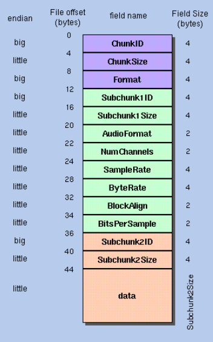
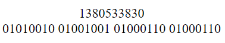
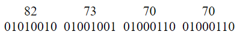
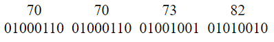

# Little Endian vs. Big Endian
September 28, 2024
Do you know the difference between Little Endian and Big Endianness?

Recently, I started to write a reader for `.wav` files that contain PCM audio. The file format is as follows.

<figure>

<figcaption> <i> WAVE File format. <a href="http://soundfile.sapp.org/doc/WaveFormat/"> source </a> </i> </figcaption>
</figure>

The leftmost column describes endianness of the binary data. To ensure applications running in different operating systems on different processors understand the same data when reading a stream of bytes, it is important to know what Endianness is.

Endianness depends on what bytes you see first when reading from left to right. In real life when we write a decimal number, say 491, it is in fact sum of 400, 90 and 1. The place value of 4 is much higher compared to the place value of 1. Therefore, 4 is the big-end of the number and 1 is the little-end of the number.


From the WAVE header `ChunkID` is always `RIFF` in ASCII, this is the specification of the RIFF file format. WAVE files also use the RIFF format with `Format` (8 to 12 bytes) as `WAVE` in ASCII. The hexadecimal representation of RIFF is `0x52494646` in big endian format.

Therefore, the first 4 bytes of any file conforming to the RIFF spec will always contain `0x52494646`. How do you verify this when running in a Big Endian machine or a Little Endian machine?

The decimal value of `0x52494646` is 1380533830. In binary:

<figure>

</figure>

Big Endian representation of the number looks like the following image:

<figure>

</figure>

For clarity, I added the decimal representation of a single byte on top of the binary representation.

and the little endian version:

<figure>

</figure>

If you notice, all binary numbers as we know, are represented in big-endian form. So, theoretically, I could read the first 4 bytes from the file and cast it into a 32 bit integer and expect the decimal value of the integer to be 1380533830. This is only partially true.

My PC, running Windows on an AMD processor is little-endian but my laptop running Ubuntu is big-endian. Therefore, the C++ code I wrote for reading a WAV file, that worked on my Windows PC failed its assertions when recompiled on my laptop, because the host changed and the endianness was different.

So, how do we tackle this through code?

<i> I'll assume that we are reading in Network Byte Order (Big Endian) and we are operating on a little endian machine. </i>

The first byte from the file will contain the big end of the 32 bit integer, 82. Reading the first byte and storing it in an integer will return

```
00000000 00000000 00000000 01010010
```

but we want the opposite to happen. Left-shifting each bit by 24 bits will place the first byte in the correct position.

```
01010010 00000000 00000000 00000000
```

Now, when we read the second byte, 73, it will be stored as

```
00000000 00000000 00000000 01001001
```

This should be the second byte in big endian order, so, left shift each bit by 16 bits. To ensure the second byte is also set in the original integer, perform a bitwise OR operation on both the numbers. The resulting number will contain the first 16 bits set, in big endian order.

```
01010010 01001001 00000000 00000000
```

You get the idea.

```c++
uint32_t chunk = 0;
    for (int i = 0; i < n; i++) {
        uint32_t t = 0;
        in.read((char *)&t, 1);  // read 1 byte from ifstream
        chunk |= t << (8 * (n - i - 1));
    }
return chunk;
```

Assuming you're in a 4 byte integer env, each byte has to be left shifted by `4-i-1` bytes, where `i` is the zero based index of the byte you're reading.

If you want to represent the number in little endian format, you can just read the `n` bytes from the input file stream `ifstream` and cast it into the desired container.

That's it.

_~rahultumpala_
