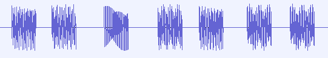
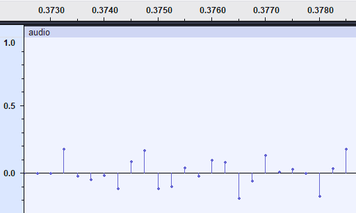
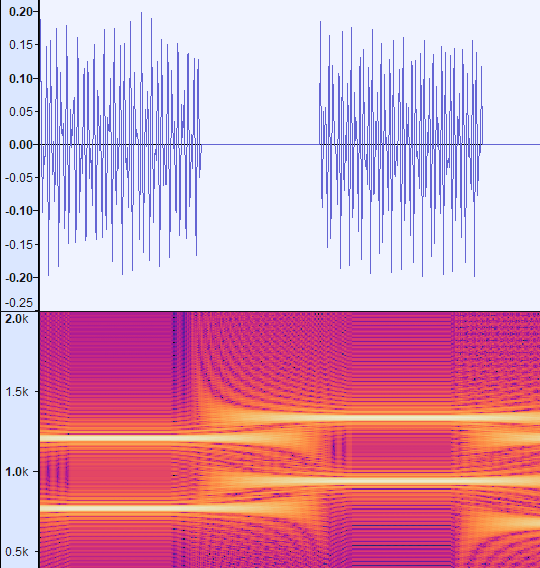

# Decoding a DTMF phone number from .wav file
October 05, 2024
Learn how to decode a DTMF sequence — a phone number — from a .wav file

_This is a writeup for the Touch-Tone Dialing challenge presented in the [hackattic challenge set](https://hackattic.com)._

_Given a `.wav` file that contains multiple different sounds where each sound corresponds to a letter in the set 0123456789#*. The task is to find the corresponding letter for each sound in the wav file. The generated sequence is then submitted and validated._

## An intro to Audio in computers

The sounds correspond to DTMF signals. DTMF stands for Dual-Tone Multi-Frequency, meaning, each sound has a unique high tone, low tone pair. No two sounds have the same set of high and low tones. Therefore, it is possible to deterministically arrive at the correct, unique solution for each different wav file.

When I started this challenge, I had zero idea how audio is stored in files, let alone how to read a file based on its format. I always wanted to get into this zone but never found a good excuse to do it, until now.

As we know very well, audio is a wave, and this wave produces disturbance that bounces off our eardrums, which we perceive as sound. Now, computers are discrete systems and cannot store a wave, as it is, without consuming a ton of storage. Instead, what computers do, is look at the wave as a plot of amplitude against time and sample the amplitude at regular intervals — this is the **sampling frequency / sampling rate** — and store these amplitudes as raw data. This is known as Pulse-Code Modulation(PCM).

As per the Nyquist-Shannon Sampling theorem, it is possible to reconstruct a continuous wave from a discrete sample when the sampling frequency is at-least twice the frequency of the original audio. Humans can hear upto atmost 20kHz and so the generally used sampling frequency is 44.1kHz (amplitude values are taken every 44,100 times each second!).

This is a lot of data, storing this as a 32 bit integer takes up 44,100 * 4 bytes = 176,400 bytes ~ 172kb of data per second. So, a 5 minute song needs 172kb * 300 =~ 51.6mb. This is a lot! Contrast to that of a 16 bit integer, you need only 25.8mb. `.wav` files store uncompressed audio while `.mp3` and other formats store compressed audio but that is out of the scope of this article. In the context of this challenge we deal with a 2-second audio that stores amplitude in 16bits. This is known as **bit depth**.

Great! Now you understand the basics of audio storage in computers. We've successfully converted a continuous analog wave into a discrete digital signal. How to convert back? How to find the underlying frequencies? This is where the Fourier transfrom comes into picture. Go watch [Vertiasium's](https://www.youtube.com/watch?v=nmgFG7PUHfo&t=445s) and [3b1b's](https://www.youtube.com/watch?v=spUNpyF58BY&t=477s) amazing videos on this topic, and internalize the concept. Internalizing this concept is probably the hardest part.

Fourier Transform and FFT are great to find all the enclosed frequencies, but the DFT is computationally slow compared to the FFT but there's no guarantee our sample size is a power of 2. This is where the Goertzel algorithm shines. Goertzel Algorithm is fast and is used when looking for traces of a single frequency in the audio sample. In fact, this is the actual algorithm used in embedded systems to decode the DTMF signal.

This is exactly what we'll be doing too.

## Detecting the enclosed frequencies

To help you deepen your understanding on what we're dealing with, load the file into Audacity and have a look at the waveform.

It'll look similar to the following image:

<figure>

<figcaption><i>Fig 1. Waveform</i></figcaption>
</figure>

The peaks and troughs you see here are the amplitudes — pulses — of the audio. We percieve this as a waveform since the sampling rate is high. When looked at closely, we can see the actual pulses.

<figure>

<figcaption><i>Fig 2. A plot of amplitude against time</i></figcaption>
</figure>

The following image shows each distinct waveform that is separated by a bit of silence, this is a DTMF signal. That is, there is a high tone and a low tone associated with it. It's easy to understand this by looking at the spectrogram of this waveform.

<figure>

<figcaption><i>Fig 3. Spectrogram</i></figcaption>
</figure>

You can easily see the bright lines in the spectrogram that correspond to a high tone (>1kHz) and a low tone (<1kHz). This unique combination corresponds to a letter in the set _0123456789#*_.

Great! now we have to find this, programmatically!

## Implementation

The Goertzel algorithm is capable of telling us if a frequency is present in the sample or not. But how to generate the sample? what is our sample here?

From Fig 1, filter the sound signal by separating it from the silence surrounding the signal; that is our sample, the input to the Goertzel algorithm.

The easiest way to find the high and low tones in the sample is to apply the goertzel algoritm for each constituent frequency of the DTMF signal. All the frequencies that make up the DTMF signal are _697Hz_, _770Hz_, _852Hz_, _941Hz_, _1209Hz_, _1336Hz_ and _1477Hz_.

So, apply the goertzel filter for the sample for each of these frequencies and record their magnitudes. In low tone range (<1kHz) and high tone range (>1kHz) pick the frequency with the highest magnitude, this is the {low tone, high tone} pair that gives us the button that was dialed.

This brute force technique works because the goertzel filter is computationally inexpensive.

The implemention in Elixir lang is as follows:


```elixir
  def goertzel(sampleRate, sample) do
    freqs =
      Enum.map(@target_freqs, fn target_freq ->
        # IO.inspect({"CURRENT TARGET FREQ", target_freq})

        # The actual goertzel filter code, based on the wiki article linked below.
        w = 2 * Math.pi() * target_freq / sampleRate
        coeff = 2 * Math.cos(w)

        {q1, q2} =
          Enum.reduce(sample, {0, 0}, fn point, {q1, q2} ->
            q0 = coeff * q1 - q2 + point
            {q0, q1}
          end)

        magnitude_sqr = q1 * q1 + q2 * q2 - q1 * q2 * coeff

        {target_freq, magnitude_sqr}
      end)

    # categorize into high and low bins based on tone range
    {high_freqs, low_freqs} =
      Enum.reduce(freqs, {[], []}, fn {freq, magnitude}, {high, low} ->
        cond do
          freq > 1000 -> {[{freq, magnitude} | high], low}
          freq < 1000 -> {high, [{freq, magnitude} | low]}
        end
      end)

    high_freqs = Enum.sort_by(high_freqs, &Kernel.elem(&1, 1), :desc)
    low_freqs = Enum.sort_by(low_freqs, &Kernel.elem(&1, 1), :desc)

    # pick the frequency with the highest magnitude in each tone range.
    [{high, _} | _] = high_freqs
    [{low, _} | _] = low_freqs

    IO.inspect({high, low})

    get_dtmf_char({high, low})
  end
```


whereas the `get_dtmf_char` is only a static map as follows

```elixir
defp get_dtmf_char({high_freq, low_freq}) do
    case {high_freq, low_freq} do
      {1209, 697} -> "1"
      {1336, 697} -> "2"
      {1477, 697} -> "3"
      {1209, 770} -> "4"
      {1336, 770} -> "5"
      {1477, 770} -> "6"
      {1209, 852} -> "7"
      {1336, 852} -> "8"
      {1477, 852} -> "9"
      {1336, 941} -> "0"
      {1209, 941} -> "*"
      {1477, 941} -> "#"
       # this never happens in the context of this problem
       # when the samples are generated properly
       # as described above.
      _ -> "."
    end
  end
```

That's it! I hope you have as much fun learning as I did while solving this problem. Solving this problem was quite a rewarding experience.

_Other References:_

1. _DTMF on Wikipedia_ - [link](https://en.wikipedia.org/wiki/DTMF)
2. _Goertzel algorithm_ - [link](https://en.wikipedia.org/wiki/Goertzel_algorithm)
3. _Nyquist-Shannon sampling theorem_ - [link](https://en.wikipedia.org/wiki/Nyquist%E2%80%93Shannon_sampling_theorem)
4. _Audacity_ - [link](https://www.audacityteam.org/)

_~rahultumpala_