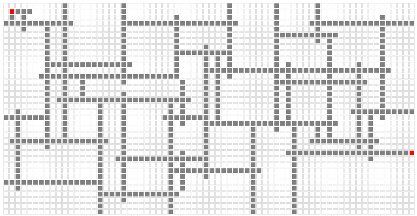
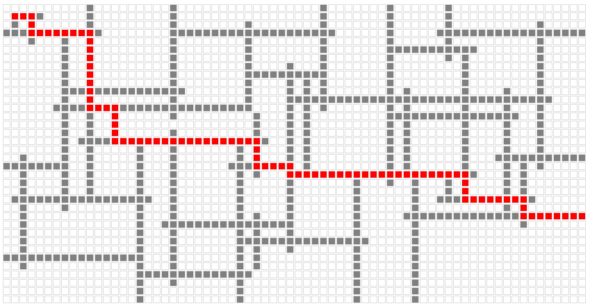

# Random Map Generation with Javascript
December 23, 2024
Generate random maps with only JavaScript and visualize graph traversal algorithms on it.

I've long wanted to build an algorithm visualizer but never ventured into learning front-end frameworks to achieve this.

I like the concept of building something from scratch, even if it isn't as great as something that's already out there. This way, I feel a sense of achievement when I complete the task, because the effort is all mine, and I'm not relying on someone else's work to produce a finished product.

---

I've been playing games recently and wondered how I could generate a random map for each level of the game. I assumed a map would be represented as an `N x M` grid containing different values, upon which assets could be used to generate terrain and environment. The values of the grid, the direction in which the values are flowing, and the density/sparsity of the values are all important in generating a random map.

I figured HTML, CSS, and JS would be sufficient to achieve this. HTML will have the base layer upon which my JS code will generate a series of `div`s, which will then be colored and ordered using CSS. Simple.

In addition, I will need one button: _to refresh the map_ and one slider: _to control the density of the map_.

To make the map visually appealing, I wanted one condition to be met: _All parallel filled elements must have at least one empty element separating them_. This is required to make sure there aren't clusters of filled elements.

Now, each element of the grid will be a square of 10px with a grey border of 1px. Moreover, there will be a 1px gap between adjacent cells.

The number of rows and columns of the grid are generated as per the above measurements to fill about 90% of the screen.

To ensure randomness in the generated grid, there are two parameters that can be controlled:
<ol>
<li>Number of consecutive elements to be filled before spreading into all directions. </li>
<li>Whether to turn or not when the chance to turn has come. </li>
</ol>

Tuning these two parameters will influence the density of the generated map.

> 1. Number of consecutive elements to be filled before spreading into all directions.

This parameter is controlled by the slider.

> 2. Whether to turn, or not, when the chance to turn has come.

To randomize the probability of this decision is the refresh button's responsibility.

And... that's it. This is all we need to generate a random map.

The `element.style.backgroundColor` property of each DOM element can be used in changing the color of the grid element.

While generating the grid, we populate the array value with 1 to indicate it is filled and with 0 to indicate otherwise. Each generated `div` will have the id `x,y` where `x` is the row and `y` is the column in both the array and grid.

Therefore, the background color of the generated div is:
<ol>
<li> White when  `grid[x,y]` is 0 </li>
<li> Grey when  `grid[x,y]` is 1 </li>
</ol>

To make this a bit more interesting, the cell denoted by `[1,1]` and the bottommost cell of the last column will be filled in red to indicate the start and end points of the grid.


When finished, the end result will be similar to the following image:

<figure>

<figcaption> <i> Generated random map with start and end points marked in red. </i> </figcaption>
</figure>

Now that we've identified the start and end points of the grid, the next step is to apply traversal algorithms to find a path from start to end.

I've implemented Depth-first search(DFS) that finds one possible path from start to end (not necessarily the shortest) and Breadth-first search(BFS) that will result in the **shortest** path. It is possible to modify the DFS implementation to find the shortest path, but I've left it as is to show the differences in both.

The shortest path can now be visualized by changing the background color of each cell in the path from grey to red (or any other color).

<figure>

<figcaption> <i> Shortest path from start to end. Found using Breadth-first search (BFS). </i> </figcaption>
</figure>

The code for generating this array is as follows:


```javascript
function travel(x, y, dir, movesBeforeTurning) {
  if (invalid(x, y)) return;

  array[x][y] = 1;

  // Tune this to control the density of the map
  dontTurn = turnProbability > getRandomInt(1000);
  if (dontTurn || movesBeforeTurning > 0) {
    let move = deltaMap[dir][dir][1];
    let nextX = x + move[0];
    let nextY = y + move[1];

    if (invalid(nextX, nextY) || hasAdjacentLine(nextX, nextY, dir)) return;

    return travel(nextX, nextY, dir, randomizeFreq(movesBeforeTurning));
  }

  for (d in deltaMap[dir]) {
    count = deltaMap[dir][d][0];
    move = deltaMap[dir][d][1];

    if (invalid(x + count * move[0], y + count * move[1]))
      continue;

    let nextX = x + count * move[0];
    let nextY = y + count * move[1];

    if (hasAdjacentLine(nextX, nextY, d)) continue;

    array[x + move[0]][y + move[1]] = 1;

    travel(nextX, nextY, d, randomizeFreq(movesBeforeTurning));
  }
}
```

An array is already initialized with all zeros before invoking the travel method. `travel(x,y,k)` travels the grid recursively and populates it with 1s.

`turnProbability` is the value that is being modified behind the refresh button.

`turnFrequency` is the value that is being controlled with the slider, and `randomizeFreq(val)` is the helper method that uses it.

```javascript
let randomizeFreq = (val) => val > 0 ? val - 1 : getRandomInt(turnFrequency);
```

`movesBeforeTurning` is initially set to 10; when all 10 moves are finished, i.e., when 10 consecutive cells are filled with 1s, a chance to make a turn appears, and the probability of this chance being successful is governed by `turnProbability > getRandomInt(1000);`. Therefore, the higher the value of `turnProbability`, the greater the chance to turn, and more randomness is introduced into the grid.

`getRandomInt(x)` generates a random non-negative number less than `x`.

`hasAdjacentLine(x,y,dir)` checks if there are any parallel filled cells and whether they're separated by at least 1 cell or not. If not, the path is not taken.

`deltaMap` produces the movements that are required to ensure there aren't any parallel adjacent lines when taking turns. It ensures that any turn is followed by at least one more cell being filled in the same direction before taking another turn. This way, parallel adjacent filled cells can be avoided, and every path is taking 3 cells (empty, filled, empty) in that sense.

I think the next natural step would be to utilize this in a game engine by rendering clusters of white blocks as buildings and the grey path as the road. That would be fun. Maybe I'll use this as an excuse to learn the Godot game engine.

[Have a look at the demo](../source_code/random-map/index.html). You can also read the [javascript code](../source_code/random-map/script.js), annotated with comments, for more understanding.

Thanks for reading.

_~rahultumpala_